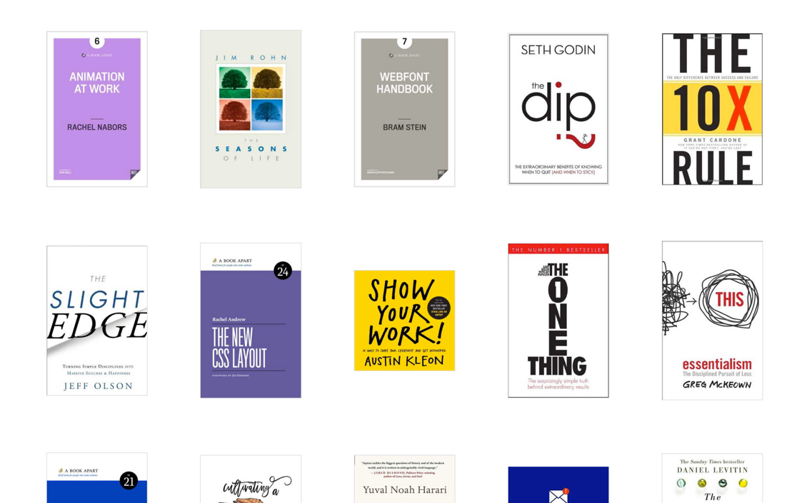
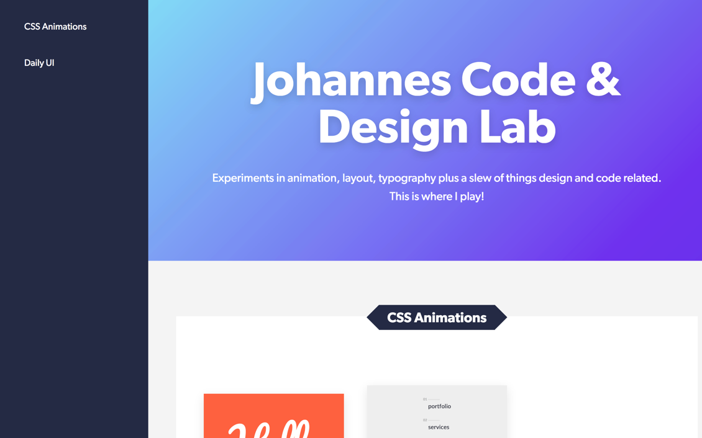

Things created just for the fun of it.

## [bookshelf.holmberg.io](https://bookshelf.holmberg.io)

95% of the books I read is done on the Kindle. I love the experience of reading and highlighting on it (which [I wrote about here.](/2015/08/that-wonderful-habit-of-reading)) The only downside for me is that I have no real overview of the books I’ve read in the past. That’s why I created this little site where I can keep a book archive with their respective highlights, notes and thoughts.

## [labs.holmberg.io](https://labs.holmberg.io)

On this micro site is where I put all my smaller experiments with code and design.
