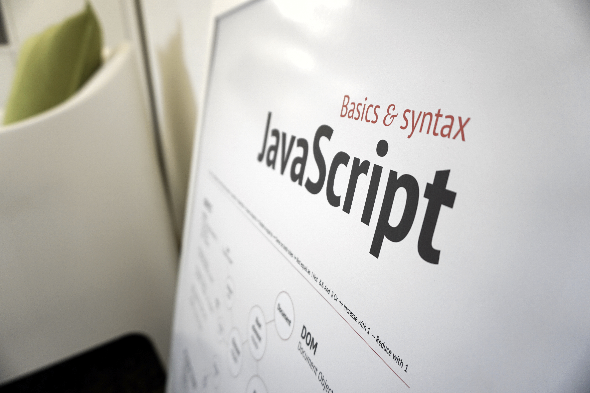
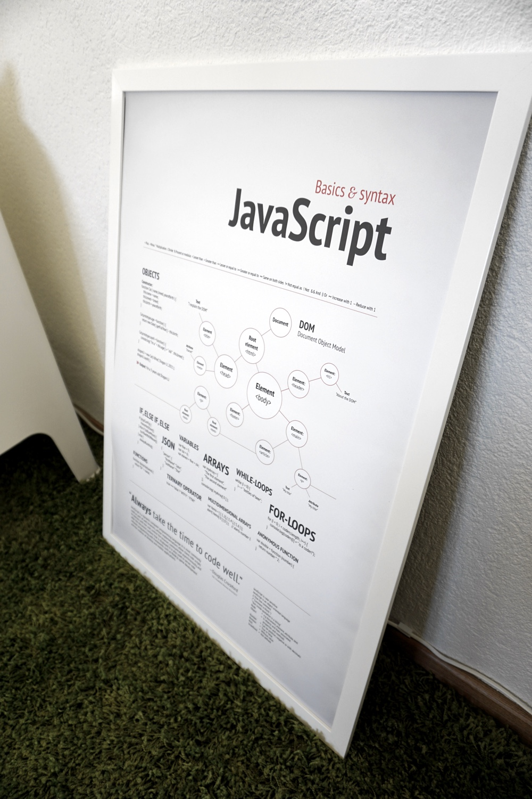
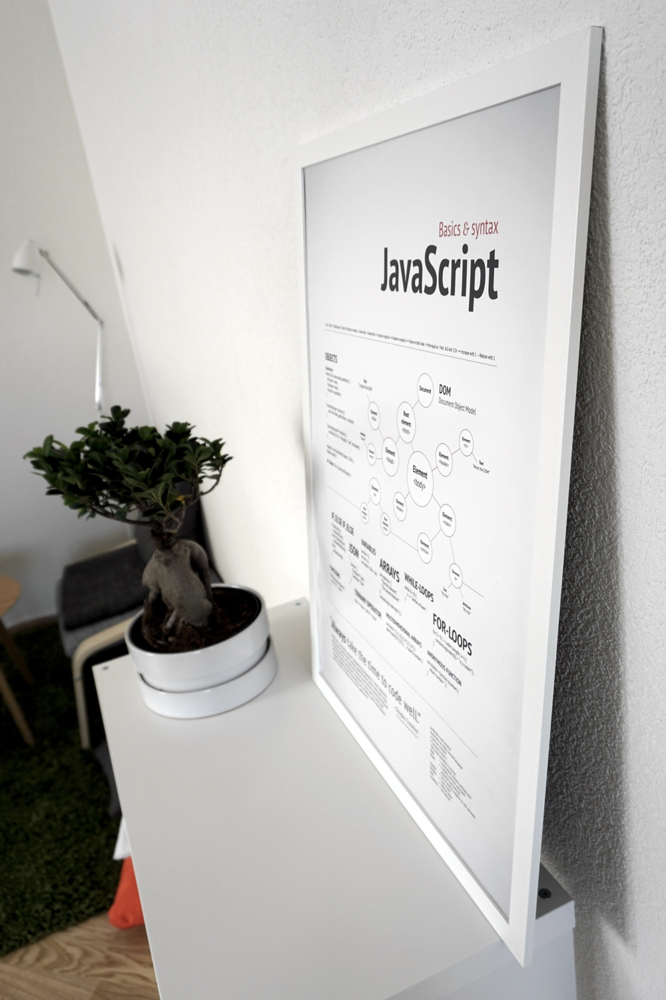

Late last year, [@tobiassjosten](https://twitter.com/tobiassjosten) and [@danniel](https://twitter.com/danniel) approached me and asked if I would be interested in doing a new concept for code posters.

I was quite intrigued, I haven’t been doing print work in years and thought it would be a fun challenge. First out was to create a concept around the basics and syntax of JavaScript. The guys provided me with basic information what they wanted to have on the poster and I took it in and came up with this design.

If you’re interested in acquiring a copy, you can head over to [coderprint.com](http://coderprint.com). Also let me know what language you want to see on the next one.
