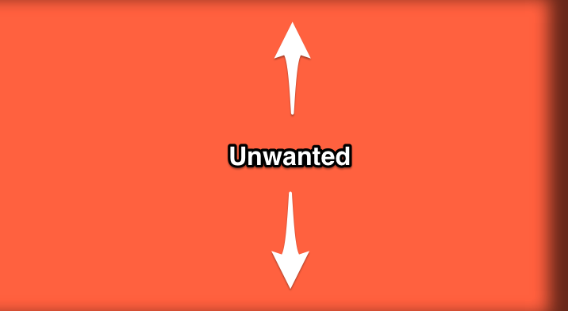

A little CSS problem that’s been bugging me for some time is the inability to set an inset box shadow, for one side only.

You see, if I do `box-shadow: inset -12px 0 15px rgba(0, 0, 0, .6);` it will give me this result:

Today, I set off to find a proper solution to the problem and it was much easier than I could have imagined. There is a fourth attribute for the box-shadow propery which controls the spread radius. By using a negative unit for the spread radius; I could actually position the shadow outside the box and then bring it back to view only for the side I want. Simple. `box-shadow: inset -12px 0 15px -10px rgba(0, 0, 0, .6);`

You can see the result in the pen below.

<iframe height='450' scrolling='no' title='Inset Shadow (one side)' src='//codepen.io/johannesholmberg/embed/JdBgWZ/?height=265&theme-id=0&default-tab=css,result&embed-version=2' frameborder='no' allowtransparency='true' allowfullscreen='true' style='width: 100%;'>See the Pen <a href='https://codepen.io/johannesholmberg/pen/JdBgWZ/'>Inset Shadow (one side)</a> by Johannes Holmberg (<a href='https://codepen.io/johannesholmberg'>@johannesholmberg</a>) on <a href='https://codepen.io'>CodePen</a>.
</iframe>
