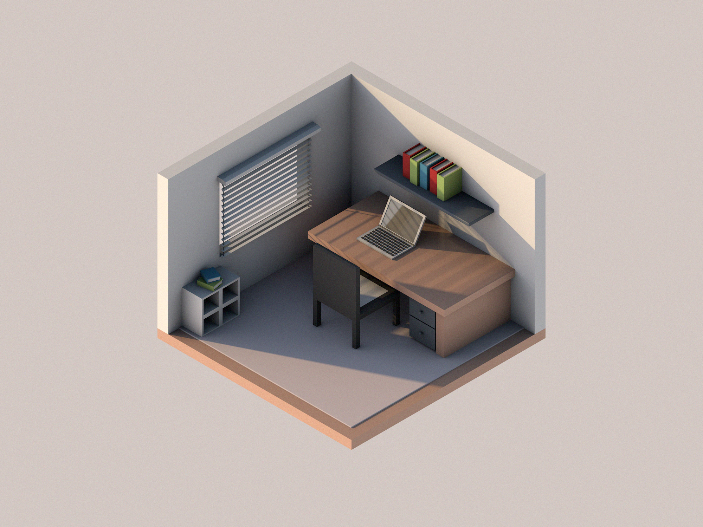

This weekend I made my first isometric render of a room. This was the third scene I made for the November project of learning how to model in 3D. I have only one scene to go to reach my goal for what I wanted to achieve this month.
