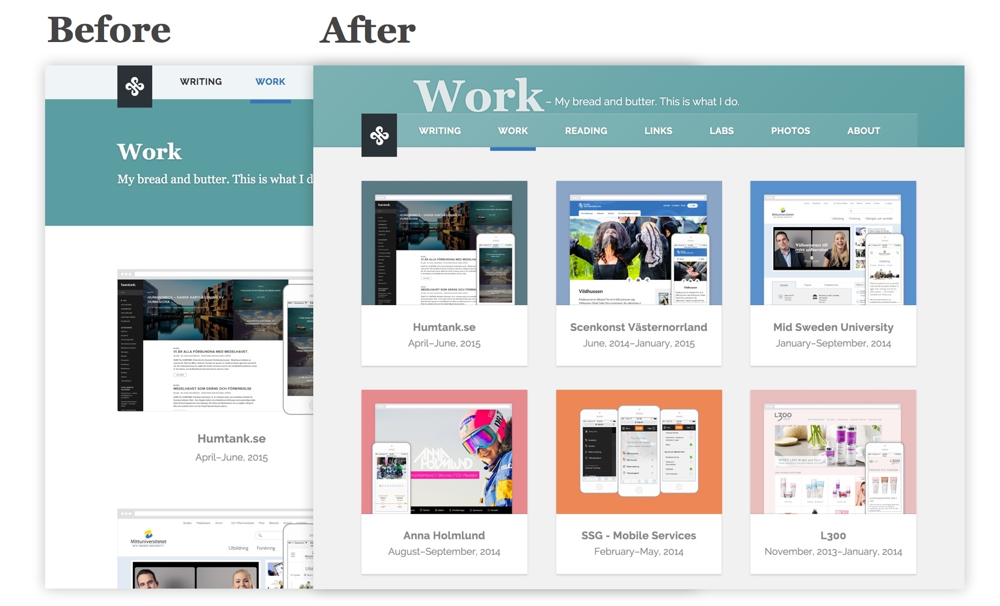
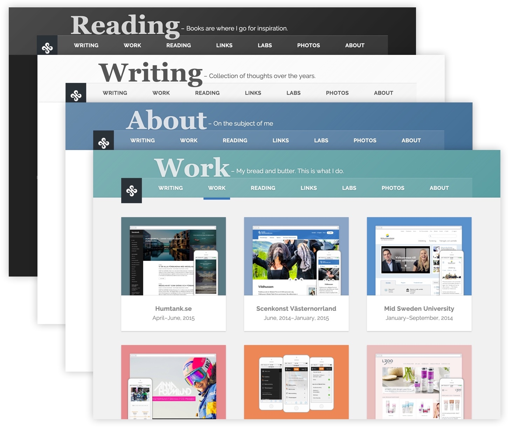
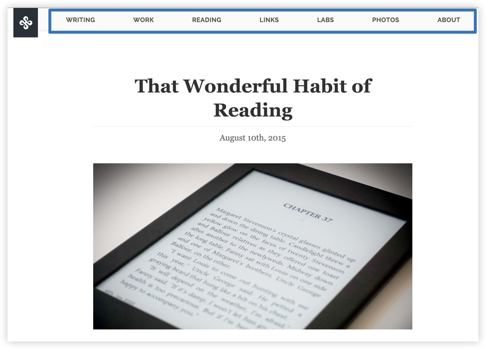
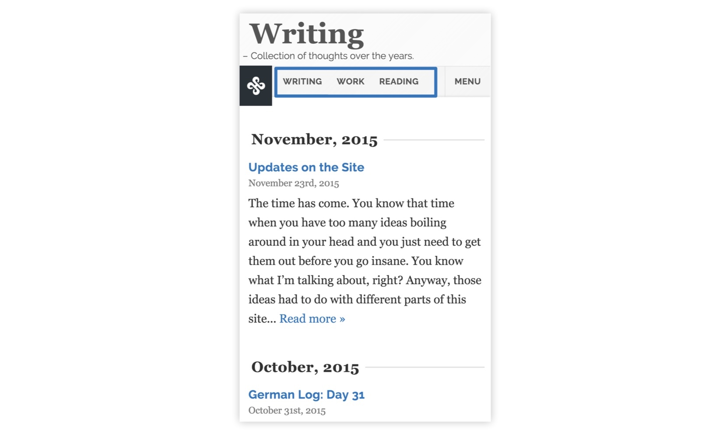

The time has come. You know that time when you have too many ideas boiling around in your head and you just need to get them out before you go insane. You know what I’m talking about, right?

Anyway, those ideas had to do with different parts of this site and I couldn’t put up with it any longer. I wanted to try out some new things and fix some others. That’s why I sat down doing some coding this weekend.

## A new masthead

The masthead is probably what’s been bothering me the most. I thought it took up way too much vertical space. On laptop screens for instance, which don’t have so much vertical space, the header would take up almost half the screen estate. It was completely unneccessary and needed to be adressed.

I also had some ideas for a new creative direction I wanted to try out. After a few iterations with mockups and prototypes I came to this result. Before and after the modification:

The result shows much more content directly visible in a compact viewport. Exactly what I was trying to achieve.

I removed the whole title section for the page and moved it up to sit on top of the navigation instead. Something I don’t see that often but I think it gives a nice visual touch to the site. It also gives me the ability to create some unique headers by giving them a color. That color shapes not just the header itself but automatically also changes the visuals of the navigation.

## Compress that navigation

For plain content pages (cases, articles, book entries etc.) I remove that title section and compress the navigation again, since the content is the most important thing on these pages.

## Show what you can

I’ve never been a big fan of the hamburger menu so I wanted to try something else for the navigation on mobile/narrow screens. Instead of just hiding everything away in a drawer, I show as much as I can. So for example on very narrow screens, maybe 2 items can fit for the navigation. When the screen gets wider, maybe 3 can fit, and then 4 and so on. In addition to this there is always a link with the label “Menu” visible, which will take you to the full menu in the footer.

## Conclusion

This site has always been a huge playground for me and I’m happy with these updates. I’m very much a fan of this iterative process and launching small instead of doing a huge redesign every 2-3 years. It means the site keeps on living so much longer and I’m learning with it. The next thing to add is probably tags for the posts. It will help with archiving and enable me to create smaller, more relevant pages as the site is growing.
