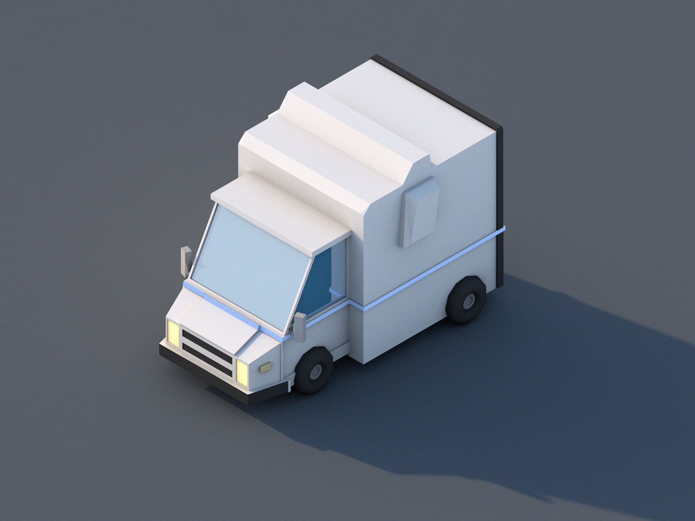

The last scene for my November project. I created a low poly truck. This was a bigger exercise in modeling and took me almost 3 hours to complete. I had to start over several times but I was quite satisfied when I finally got it right.

This ends my November project. I finished the 4 low poly scenes that I sat up as a goal at the beginning of the month. It was a funny project. I’ve gained more 3D skills and will probably use another labs month in the future to continue this development.
