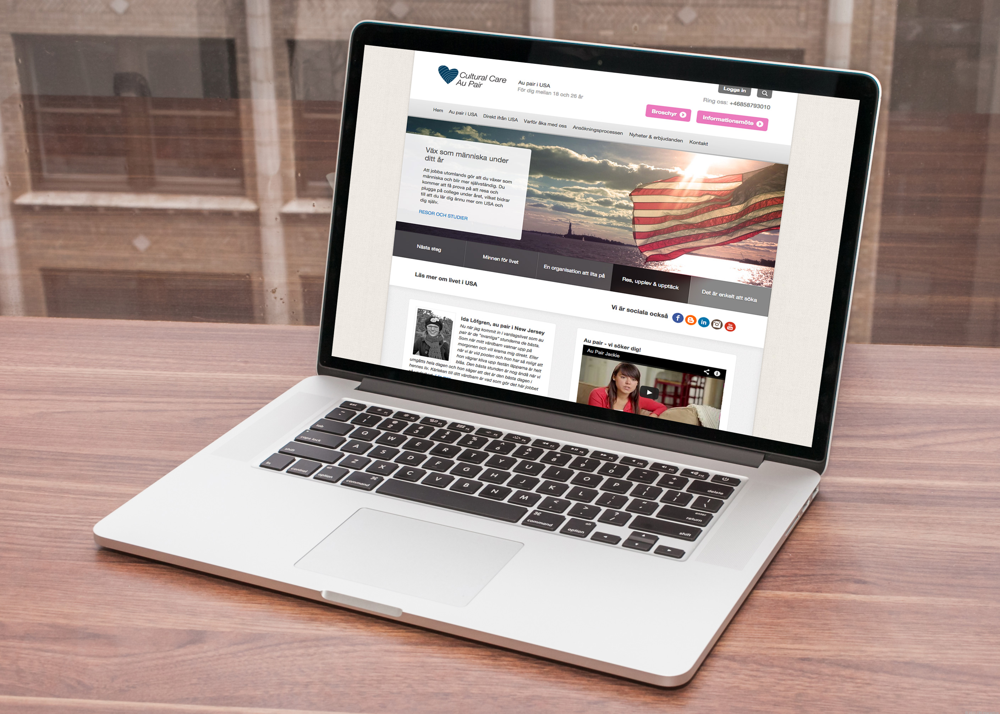

While working in-house at [EF](http://ef.com) in 2012 I designed and developed the responsive frontend for Cultural Care Au Pair’s 20 international marketing websites. To integrate them, I worked closely with the in-house backend development team in Bangalore who developed the websites in .Net MVC.

