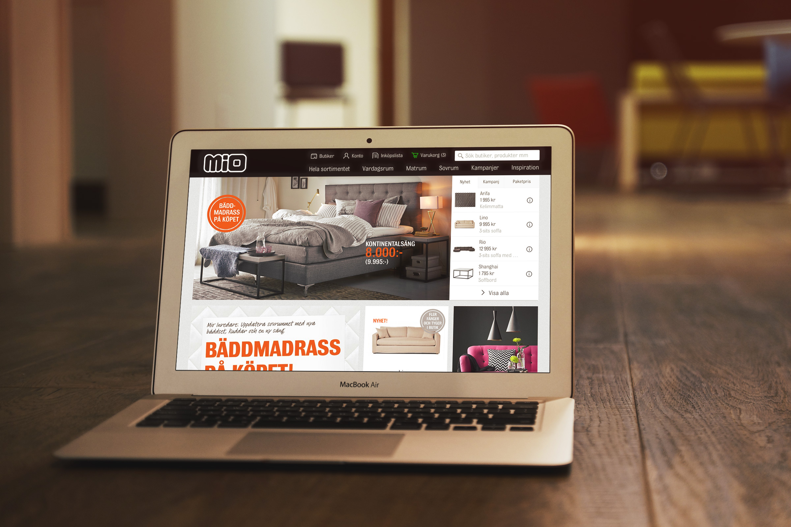
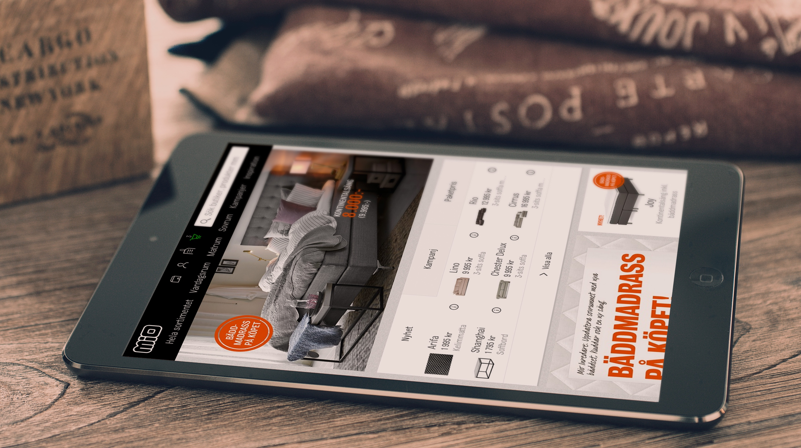
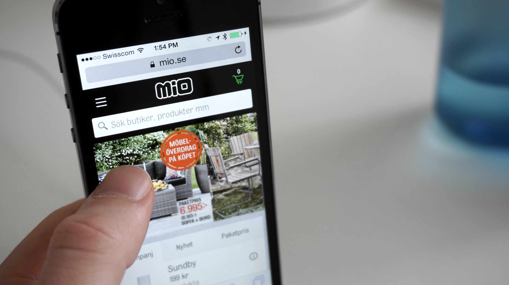

**I got the amazing** opportunity to work on the frontend for Mio’s new e-commerce website. It was a complete overhaul with a responsive foundation. During the process I worked tightly with a team of skilled engineers and backend developers from [Valtech] and [Enferno].

[Valtech]: http://www.valtech.com/
[Enferno]: http://www.enferno.se/
