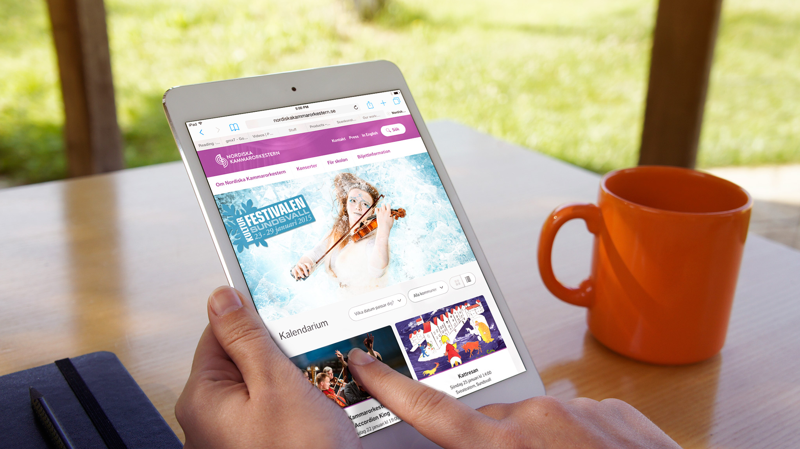
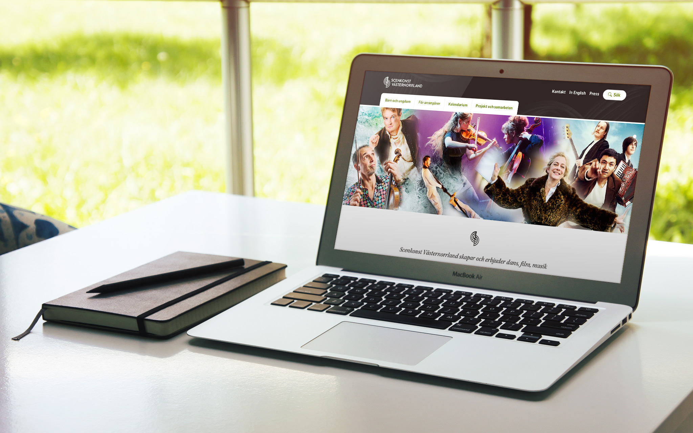

Scenkonst Västernorrland (The Stage Company) was in great need of refurbishing their digital presence to reach a wider audience. The challenge was to have all their 6 sub departments in music, film, theater and dance (each with its own brand) to play together and be part of the whole solution.

## Process

The process was collaboration from start to finish. We settled very early in the project to work in 1-week sprint cycles to ensure that communication was being held on a frequent basis. That way, the client could come with feedback throughout the whole process and we could verify our work from week to week. We used a shared [Trello] board to get an overview of the tasks in the project.

## Solution

The solution is a WordPress Multisite sharing the same base theme with site-specific settings. We were fortunate in having a trove of astonishing photography from Scenkonst Västernorrland to work with throughout the whole project. The administration part of WordPress has been highly tailored to fit with the needs of the client.

In this project I was working together in a team of great designers and developers from the digital agency [Osynlig] in Sweden.

[trello]: https://trello.com/
[osynlig]: http://osynlig.com
