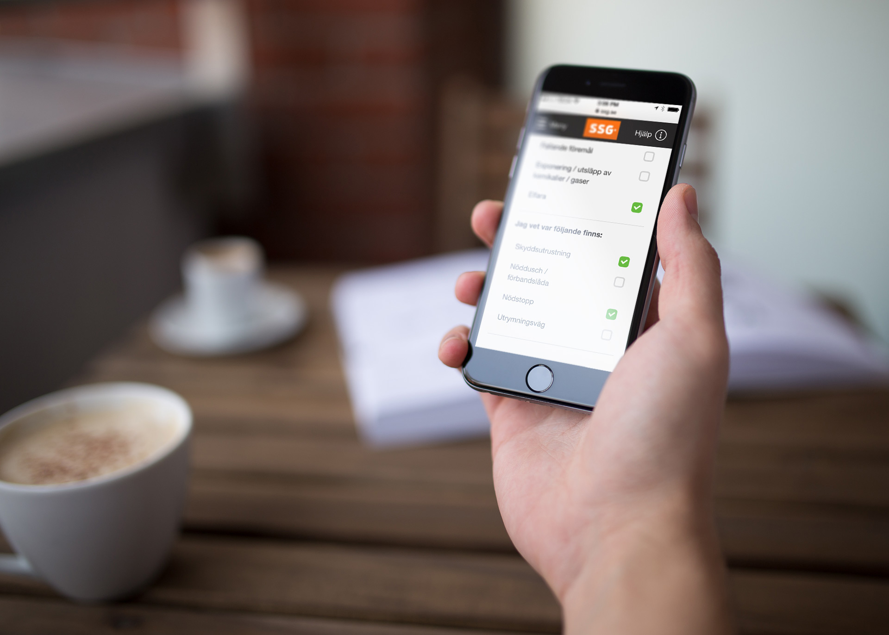

**We released** a new mobile platform for SSG (Standard Solutions Group). It’s basically a subset of their most critical applications to be available on mobile. This was a first step for them going fullscale responsive.

